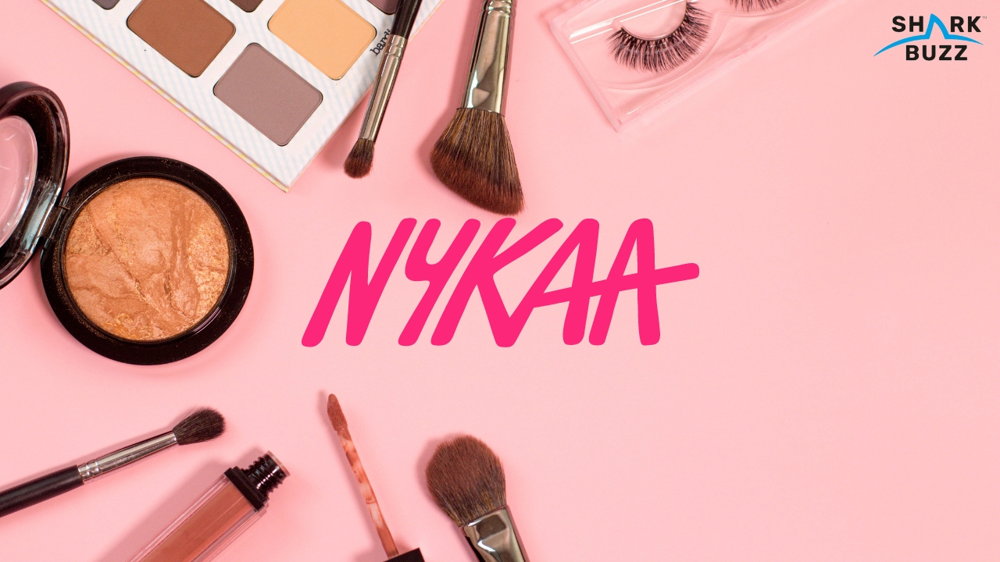

# 🛍️ Nykaa Product Data Analysis

  

## 📊 Project Overview
This project analyzes Nykaa’s product data to uncover insights into **brand performance, pricing, stock availability, discounts, and customer ratings**.  

The analysis was performed using **Python (Pandas, Seaborn, Matplotlib)** and visualized with **Power BI** for strategic business insights.

---
## 🎯 Business Objectives

1.Which brands dominate Nykaa’s product portfolio in terms of SKU count?

2.How does pricing strategy (MRP vs Selling Price) vary across brands?

3.What is the impact of discounts on customer appeal and sales potential?

4.Which brands face the highest out-of-stock issues, leading to lost sales?

5.What are the top 10 products by MRP and discount percentage?

6.Which brands consistently achieve the highest average customer ratings?

7.How do ratings correlate with customer trust?

8.Which categories and brands provide opportunities for business growth?

---
## 📷 Power BI Dashboard

  

## 🧩 Key Insights
- **Nykaa-owned brands dominate** with 1,253 SKUs (~40% of portfolio) → signals strong private label play.  
- **Out-of-stock products** in brands like Biotique (370 SKUs, many unavailable) → lost sales potential.  
- **Top 10 brands** (Nykaa, Biotique, Lakme, Lotus, Maybelline etc.) make up ~70% of total inventory.  
- **Discount-heavy SKUs** (up to 60%+) drive traffic but risk profitability.  
- **Higher-rated brands** like Kay Beauty & Faces Canada (avg. >4.3) → customer loyalty levers.  

---
## 🛠️ Tech Stack
- **Data Analysis:** Python (Pandas, NumPy, Matplotlib, Seaborn)  
- **Visualization:** Power BI  
- **Dataset:** Nykaa Products (Brand, Price, Stock, Ratings, Discounts)  

